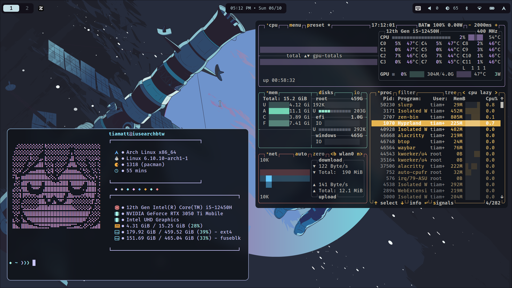
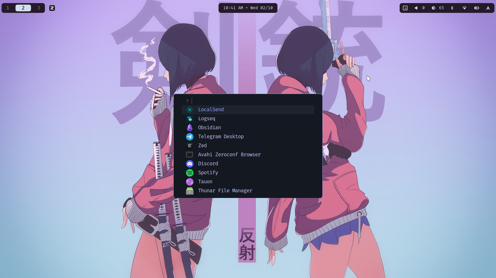

<h1 align=center>Hyprland + Arch config</h1>

> A simple Hyprland config with adaptive color scheme, packed with just the bare minimum to keep you away from all the useless "improved quality of life" shenanigans.

# Sections

 [Preview](#preview)
 [Info](#info)
 [Grant execute permission to scripts in `~/.config/hypr/scripts/`](#grant-execute-permission-to-scripts-in-confighyprscripts)
 [Keybinds](#keybinds)

## Preview






## Info
|**Specification**|**Detail**|
|:------|:-------|
|**OS**| Arch Linux|
|**WM** | Hyprland|
|**Editor**| Neovim|
|**Browser**| Zen Browser|
|**File Manager**| Thunar|
|**Fetch**| fastfetch|
|**Launcher**| Fuzzel|
|**Terminal**| Alacritty|
|**Shell**| Fish|
|**Notification**| Dunst|
|**Lockscreen**| hyprlock|
|**Color scheme generator**| pywal|
|**Fonts**| JetBrains Mono Nerd Font, FiraCode Nerd Font|
|**Music Player**| Tauon Music Box|

## Grant execute permission to scripts in `~/.config/hypr/scripts/`
```bash
chmod +x $HOME/.config/hypr/scripts/*
```
Wallpaper directory by default points to `~/Pictures/wallpapers/`

## Keybinds
| Label | Action |
| --- | --- |
|Super| Open Launcher|
|Super + Q| Close window|
|Super + P| Power Menu|
|Super + R| Quick run commands|
|Super + X| Open terminal|
|Super + L| Lock|
|Super + W| Web browser|
|Super + E| File manager|
|Super + V| Clipboard|
|Super + T| Toggle floating window|
|Super + M| Logout|
|Super + Shift + T| Toggle touchpad|
|Super + Shift + Q| Toggle window split direction|
|Super + Shift + F| Toggle fullscreen|
|Super + Shift + S| Regional screenshot|
|Print| Full screenshot|
|Super + LMB| Reposition|
|Super + RMB| Resize|
|Super + L_Ctrl + Shift + Backspace| Shutdown|
|Super + 0-9| Switch workspace|
|Super + Shift + 0-9| Move window to workspace|
|Super + arrow keys| Move focus|
|ALT + TAB| Next workspace|
|ALT + Shift + TAB| Previous workspace|
|XF86 controls keys| Volume, brightness, etc|

## Configure to your preference

**Monitors**: `~/.config/hypr/monitors/monitors.conf`
**ENV**: `~/.config/hypr/env/env.conf`
**Input devices & touchpad scripts**: `~/.config/hypr/input/input.conf`, `~/.config/hypr/scripts/touchpad-status.sh`, `~/.config/hypr/scripts/touchpad-toggle.sh`
**Hyprlock wallpaper**: `~/.config/hypr/hyprlock.conf`
